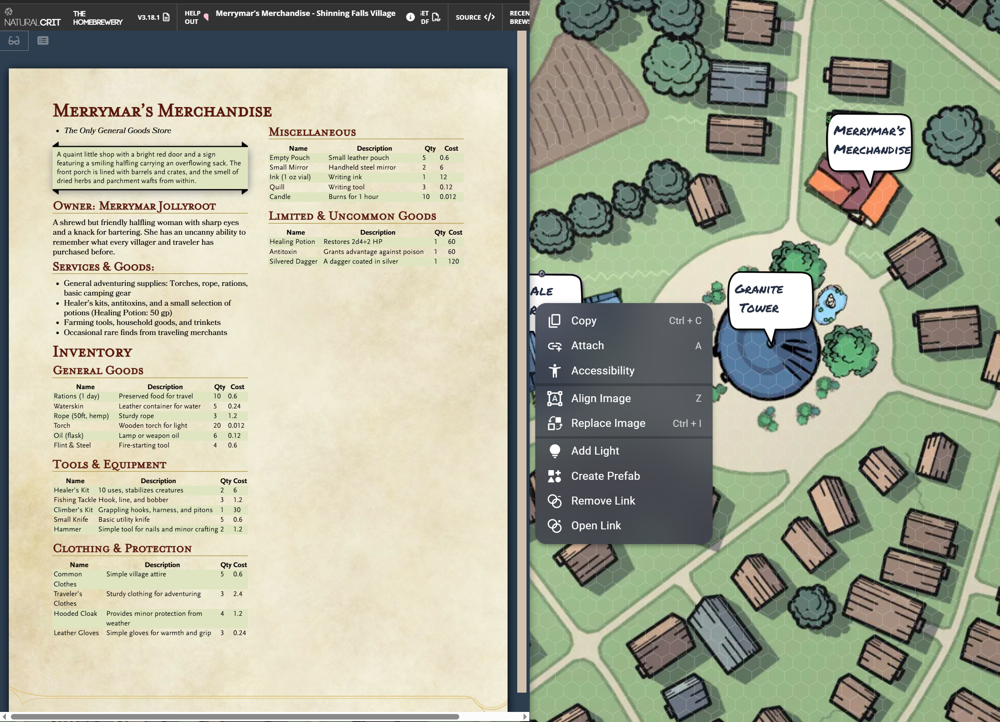
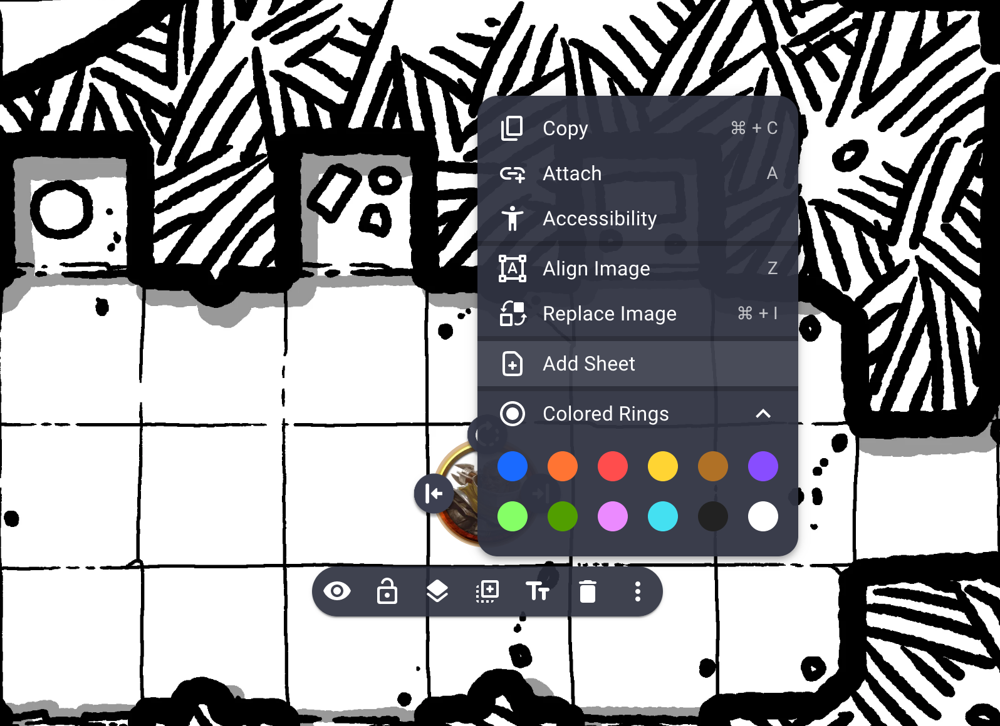
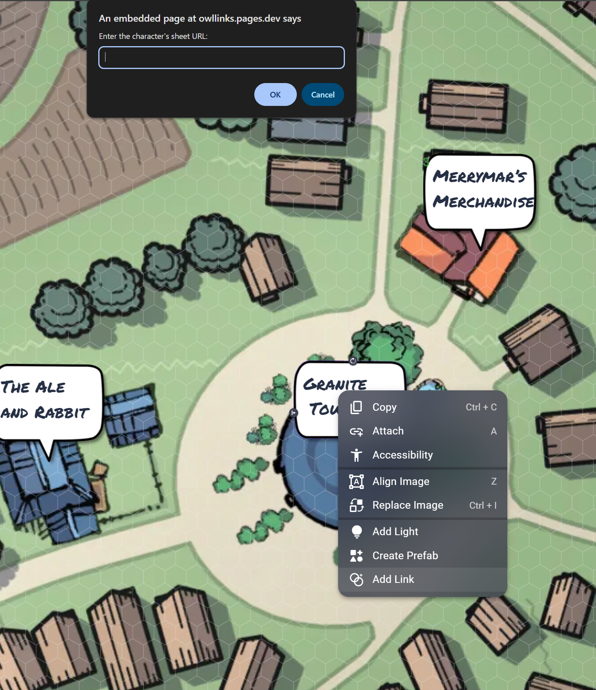
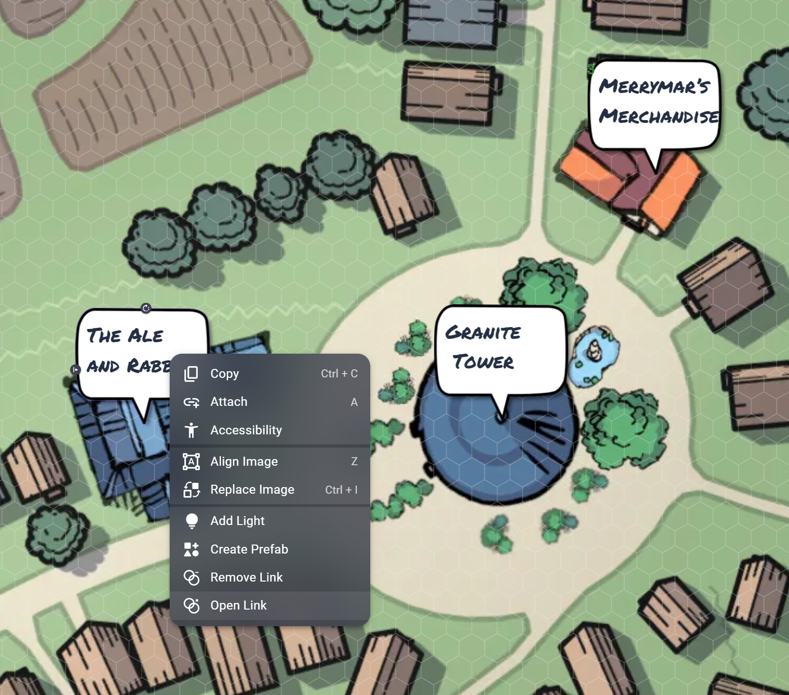
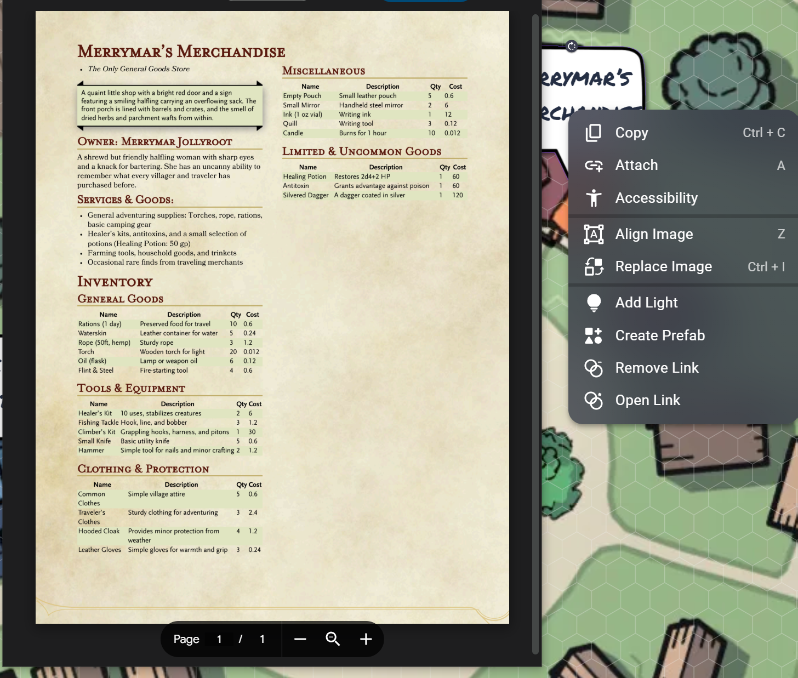

# Sheet from Beyond

## Description

Sheet from Beyond is an extension for [Owlbear Rodeo](https://owlbear.rodeo) that allows you to associate a URL to any given character token, and then to open this URL as a popover window.

## Character Sheet Support

Since Owlbear Rodeo uses an `iframe` to render the content in the popover window, some sites might block the rendering and you will need to open the sheet in a separate tab. However, when that is the case the popover window will offer the link to open in a new tab.

You can see below a support table, last updated June 5th, 2024.

| Character Sheet | Supported | Login Needed |
|--|--|--|
| D&D Beyond      | Yes | No |
| PDF (2)         | Yes | No |
| Shard           | Yes | Yes |
| Roll20 (1)      | Yes | Yes |
| Fantasy Grounds | No | |
| Foundry VTT     | No | |
| Demiplane       | Yes | Yes |
| Alchemy RPG     | No | |
| Shadowdarklings | No | |
| Diceweaver      | Yes | Yes |

If you know of any other VTT or Online Character Sheet service that could be added to the list above, feel free to create a Pull Request.

(1) [How to get the character sheet URL in Roll20](https://app.roll20.net/forum/post/9585776/character-sheet-url). However its availability **depends on your subscription level**.

(2) PDF display works fine, however it depends on how your browser handles PDF files. If it doesn't have a native reader, it will probably download the file instead.

## Permissions

- **GM**: Can Add, Remove and View sheets
- **PLAYER**: Can View sheets. Requires `Character (Update)` in `Player Permissions`

## Features

All the features below are available in the **context menu** for `CHARACTERS`.

### Add Sheet

### Enter Sheet's URL

### View Sheet

